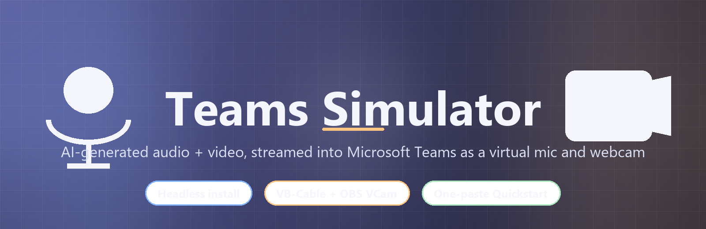
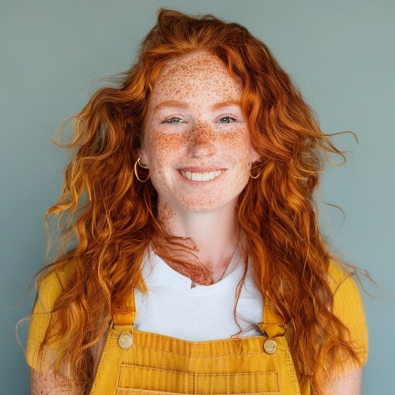
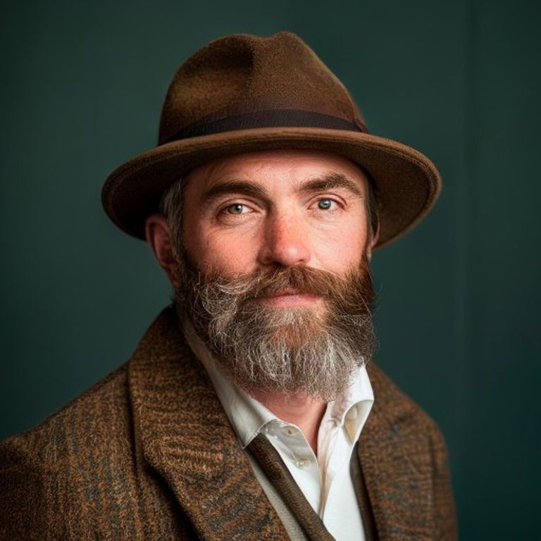

<div align="center">



# Teams Simulator

**Stream AI-generated audio + video into Microsoft Teams as if it came from a real participant.**
A virtual microphone and a virtual webcam, perfectly in sync, on a fresh Windows VM, in one paste.

[](https://www.python.org/)
[](#vm-compatibility)
[](#license--credits)
[](#)
[](#development)
[](#-quickstart--one-paste-walk-away)

</div>

> 🎙️📷 Use it to test Teams meeting features (recording, Copilot, compliance bots, transcription, …) **without needing a real participant** — and without anyone ever seeing a "this Teams meeting is being recorded" because the bot was actually a person.

---

## ⚡ Quickstart — one paste, walk away

On a fresh **Windows 10 / 11 VM**, open PowerShell **as Administrator** and run:

```powershell
iex (irm 'https://raw.githubusercontent.com/jenssgb/teams-simulator/main/setup/bootstrap.ps1')
```

That single line will:

| # | Step | What happens |
| --- | --- | --- |
| 1 | **Bootstrap** | Installs `git` (via winget), clones the repo to `C:\teams-simulator`. |
| 2 | **Python 3.11** | Installed via winget — the Microsoft Store alias trap is detected and bypassed. |
| 3 | **ffmpeg** | Installed via winget so MP3 input "just works". |
| 4 | **VB-Audio Virtual Cable** | Downloaded over TLS-1.2 with retries, silent NSIS install — kernel audio driver. |
| 5 | **OBS Studio + Virtual Camera** | Installed silently; DirectShow filter registered via `regsvr32`. No need to ever launch OBS. |
| 6 | **Auto-resume** | A one-shot scheduled task `TeamsSimulatorSetupResume` is registered, **the VM reboots automatically**. |
| 7 | **Resume after login** | Task fires at next logon (RunLevel `Highest`), creates `.venv`, pip-installs all deps, runs `verify.ps1`, prints a green **READY** banner with the exact device names — and unregisters itself. |

Then in **Teams → Settings → Devices** pick:

| | |
| --- | --- |
| 🎙️ **Microphone** | `CABLE Output (VB-Audio Virtual Cable)` |
| 📷 **Camera**     | `OBS Virtual Camera` |

…and start the simulator — easiest way: **double-click the `Teams Simulator` icon on your Desktop** (also in the Start Menu). Or from a terminal:

```powershell
C:\teams-simulator\.venv\Scripts\python.exe -m teams_simulator
```

A small Tkinter window opens, pre-wired with the bundled `samples\demo_audio.wav` + `samples\demo_avatar.png`. Pick a hipster avatar from the dropdown, hit **▶ Start**, and you're in the meeting.

---

## 🧑‍🎨 Bundled avatars

Five photoreal hipsters ship in `samples/avatars/`. Pick one from the
**Avatar** dropdown in the GUI — your choice is instantly previewed and
wired into the camera stream. Bring your own audio.

<div align="center">

<table>
<tr>
<td align="center"><br /><sub><b>Atlas</b></sub></td>
<td align="center"><br /><sub><b>Wren</b></sub></td>
<td align="center"><br /><sub><b>Cosmo</b></sub></td>
<td align="center"><br /><sub><b>Maeve</b></sub></td>
<td align="center"><br /><sub><b>Jasper</b></sub></td>
</tr>
</table>

<sub>Generated with Flux via <a href="https://pollinations.ai">Pollinations.ai</a> · regenerate any time with <code>python scripts/generate_avatars.py</code></sub>

</div>

Want a different cast? Edit the prompt list in
[`scripts/generate_avatars.py`](scripts/generate_avatars.py), re-run it,
and the dropdown picks the new lineup up automatically — it's
manifest-driven (`samples/avatars/avatars.json`).

---

## 🧩 How it works

```
your_audio.wav  ──►  sounddevice    ──►  "CABLE Input"   ──►  Teams mic
                                          (VB-Audio Virtual Cable)

avatar.png      ──►  pyvirtualcam   ──►  "OBS Virtual Camera"  ──►  Teams cam
   + waveform                              (DirectShow filter)
   overlay
```

Two virtual Windows devices do the heavy lifting:

| Device                 | Provided by                  | What it is                                                                  |
| ---------------------- | ---------------------------- | --------------------------------------------------------------------------- |
| `CABLE Input/Output`   | VB-Audio Virtual Cable       | A loopback audio driver. Anything we play to `CABLE Input` is captured by `CABLE Output`, which Teams picks as a microphone. |
| `OBS Virtual Camera`   | OBS Studio's DirectShow filter | A virtual webcam. We push BGR frames via `pyvirtualcam`; OBS itself doesn't even need to be running. |

The simulator coordinates both sides on a single timeline: it streams audio frame-accurately into `CABLE Input`, samples the RMS level, and draws an equalizer-style waveform overlay onto the avatar image so Teams participants see *"the avatar is talking now"*.

---

## 🛠️ Manual / offline install

If you can't (or don't want to) reach `raw.githubusercontent.com` from the VM, do the same thing by hand:

```powershell
# 1. copy the repo onto the VM (git clone, scp, ZIP, ...) and cd into it
git clone https://github.com/jenssgb/teams-simulator.git C:\teams-simulator
cd C:\teams-simulator

# 2. one of:
powershell -ExecutionPolicy Bypass -File .\setup\install.ps1 -Auto      # unattended + auto-reboot
powershell -ExecutionPolicy Bypass -File .\setup\install.ps1            # interactive, asks before reboot
powershell -ExecutionPolicy Bypass -File .\setup\install.ps1 -DryRun    # plan only, no admin needed
powershell -ExecutionPolicy Bypass -File .\setup\install.ps1 -NoReboot  # exit code 2 if reboot would be required

# 3. after reboot
powershell -ExecutionPolicy Bypass -File .\setup\verify.ps1
.\.venv\Scripts\python.exe -m teams_simulator
```

## 🎬 Using the simulator

### GUI

`python -m teams_simulator` opens a small Tkinter window:

* **Virtual devices** panel — green/red status for the mic and camera.
  Hit **Re-check** after running `install.ps1`.
* **Inputs** — pick any `.wav`, `.flac`, `.ogg`, `.aiff` (or `.mp3` if
  ffmpeg is installed) and any `.png`/`.jpg`/`.bmp`. The bundled
  `samples/demo_audio.wav` and `samples/demo_avatar.png` are pre-filled.
* **Options** — *Loop audio* (default on) and *FPS* spinbox.
* **▶ Start / ⏸ Pause / ⏹ Stop** — start streams audio + video atomically.
* **Live audio level** progress bar — the same RMS that drives the
  in-camera waveform.
* **Log** — INFO/ERROR messages from the controller.

### CLI / scripted

```powershell
.\.venv\Scripts\teams-sim.exe `
    --audio  samples\demo_audio.wav `
    --image  samples\demo_avatar.png `
    --loop `
    --fps 30 `
    --resolution 1280x720
```

`teams-sim --help` lists all flags. `--duration N` auto-stops after N
seconds (handy for CI).

### Programmatic

```python
from teams_simulator.sync import SimulatorController

c = SimulatorController.from_paths("meeting.wav", "avatar.png", loop=True)
c.start()
# ... do work ...
c.stop()
```

## 📁 Repository layout

```
teams-simulator/
├── README.md                    <- this file
├── pyproject.toml               <- packaging + entry points
├── requirements.txt             <- pinned runtime deps
├── setup/                       <- VM bootstrap PowerShell scripts
│   ├── install.ps1              <- headless installer (-Auto / -DryRun / -NoReboot / -Force)
│   ├── verify.ps1               <- end-to-end self-test (devices, deps)
│   ├── dryrun.ps1               <- run on the dev box; verifies install.ps1 without installing
│   ├── bootstrap.ps1            <- one-paste clone+install (irm | iex friendly)
│   ├── uninstall.ps1
│   └── README.md
├── samples/
│   ├── demo_audio.wav           <- 6 s synthesised speech-like signal
│   ├── demo_avatar.png          <- 1280x720 placeholder portrait
│   ├── avatars/                 <- 5 bundled hipster avatars + manifest
│   │   ├── atlas.png · wren.png · cosmo.png · maeve.png · jasper.png
│   │   └── avatars.json
│   └── README.md
├── assets/
│   └── hero.png                 <- README banner (AI generated, regenerable)
├── scripts/
│   ├── generate_samples.py      <- regenerates the bundled samples
│   └── generate_avatars.py      <- regenerates avatars + hero via Pollinations.ai (Flux)
├── src/teams_simulator/
│   ├── __main__.py              <- python -m teams_simulator -> GUI
│   ├── ui.py                    <- Tkinter window
│   ├── cli.py                   <- argparse CLI
│   ├── sync.py                  <- SimulatorController (the public API)
│   ├── devices.py               <- VB-Cable / OBS VCam discovery
│   ├── config.py                <- defaults
│   ├── audio/
│   │   ├── loader.py            <- WAV/FLAC/MP3 -> normalised numpy
│   │   └── player.py            <- sounddevice OutputStream + RMS meter
│   └── video/
│       ├── frame_source.py      <- image -> letterboxed BGR frame
│       ├── waveform.py          <- equalizer-bar overlay animator
│       └── streamer.py          <- pyvirtualcam loop -> OBS VCam
└── tests/                       <- pytest, no real devices required
```

## ✅ Requirements

| Component | Why                                                                |
| --- | --- |
| Windows 10 / 11 (host or VM)        | Required by VB-Audio Virtual Cable and OBS Virtual Camera. |
| Python 3.10–3.13 (64-bit)           | Runtime.                                                  |
| Administrator rights (for setup)    | VB-Cable installs a kernel-mode audio driver.             |
| Internet access (for setup only)    | To download installers / Python packages.                 |
| ~1 GB free disk                     | Python + OBS + venv.                                      |
| ffmpeg                              | Optional; only required to load MP3.                      |

GPU is **not** required — both virtual devices are pure user-space
software.

## 🖥️ VM compatibility

| Hypervisor / cloud           | Verdict | Notes |
| --- | --- | --- |
| **VMware Workstation / Player** | ✅ Best | Audio + 3D acceleration just work. |
| **VirtualBox 7.x**             | ✅ Good | Slightly slower; install Guest Additions. |
| **Hyper-V (Enhanced Session)** | ⚠️ OK | Standard session has no audio; enable Enhanced Session Mode. |
| **Azure Windows IaaS VM**      | ✅ Recommended for shared demos | Use D4s_v3 or larger. **Do not** use Azure Virtual Desktop (AVD) — it redirects Teams media to the local client. |

## 🩹 Troubleshooting

<details>
<summary><strong>Teams shows "Microphone not found"</strong></summary>

Did you reboot after `install.ps1`? VB-Cable is a kernel-mode driver and
only appears after a reboot. Run `setup\verify.ps1` — it will tell you
which device is missing.
</details>

<details>
<summary><strong>"OBS Virtual Camera not available"</strong></summary>

The DirectShow filter is registered on first launch of OBS. The setup
script does this automatically with `regsvr32`, but if it failed, just
launch `obs64.exe` once manually and close it.
</details>

<details>
<summary><strong>MP3 file fails to load</strong></summary>

Install ffmpeg: `winget install Gyan.FFmpeg`, then open a fresh shell so
PATH is refreshed. WAV / FLAC / OGG don't need ffmpeg.
</details>

<details>
<summary><strong>Audio is choppy / underruns</strong></summary>

Increase the block size in `src/teams_simulator/config.py`
(`DEFAULT_BLOCK_SIZE`) from 960 to e.g. 1920, or lower the video FPS
(GUI: Options → FPS).
</details>

<details>
<summary><strong>Lip-sync? Real avatar?</strong></summary>

Out of scope for this MVP. The waveform overlay tells Teams "this person
is talking", which is enough for most testing. See
[`plan.md`](#) for Phase-2 ideas (Azure TTS Avatar, MuseTalk, MP4 loop).
</details>

## 🧪 Development

```powershell
# Install in editable mode with dev extras
.\.venv\Scripts\python.exe -m pip install -e .[dev]

# Run the test suite (no real devices required)
.\.venv\Scripts\python.exe -m pytest

# Lint
.\.venv\Scripts\ruff check src tests
```

## 📜 License & credits

* This project: **MIT** (see `LICENSE` if present).
* **VB-Audio Virtual Cable** — donationware, redistributed installer
  downloaded directly from <https://vb-audio.com/Cable/>. Donations
  encouraged.
* **OBS Studio** — GPL v2.
* **ffmpeg (Gyan.FFmpeg build)** — LGPL v2.1.
* **pyvirtualcam** — GPL v2 (Windows backends use OBS / Unity Capture).

## 🚀 Roadmap (not in MVP)

* TTS plugin (Azure AI Speech, OpenAI TTS, ElevenLabs) — generate audio
  from text live, no need to bring a WAV.
* MP4 loop instead of static image — stream a pre-rendered avatar
  video.
* Live lip-sync via MuseTalk / Wav2Lip — needs an NVIDIA GPU in the VM.
* Azure Communication Services Teams Interop — join a meeting
  programmatically without a VM.
